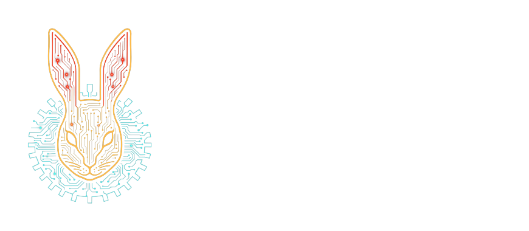

# kotlin-parsing-charset



<p align=center>
    
    
</p>

`kotlin-parsing-charset` is a Kotlin Multiplatform library for representing sets of `Char` values as
compact sorted ranges.

It is intended for parser, lexer, tokenizer, and automaton implementations that need fast character
membership checks, set operations, and deterministic partitioning of the `Char` space.

## 🚀 Installation

```kotlin
repositories {
    mavenCentral()
}

dependencies {
    implementation("one.wabbit:kotlin-parsing-charset:1.3.0")
}
```

## 🚀 Usage

```kotlin
import one.wabbit.parsing.charset.CharSet

val identifierStart = CharSet.letter union CharSet.one('_')
val identifierPart = identifierStart union CharSet.digit

check('a' in identifierStart)
check('_' in identifierStart)
check('9' !in identifierStart)
check('9' in identifierPart)
```

`CharSet` stores sorted, non-overlapping ranges, so adjacent characters are compacted into a single
range.

## Set Operations

```kotlin
import one.wabbit.parsing.charset.CharSet

val lowercase = CharSet.range('a', 'z')
val vowels = CharSet.of("aeiou")
val consonants = lowercase difference vowels

check('b' in consonants)
check('a' !in consonants)
check((vowels union consonants) == lowercase)
```

The main operations are `union`, `intersect`, `difference`, `invert`, subset/superset predicates,
and overlap classification.

## Topology

`CharSetTop` represents a partition of the whole `Char.MIN_VALUE..Char.MAX_VALUE` space. It is useful
when several character sets must be refined into disjoint basis ranges for parser or automaton
construction.

```kotlin
import one.wabbit.parsing.charset.CharSet
import one.wabbit.parsing.charset.CharSetTop

val top = CharSetTop.trivial
    .refine(CharSet.digit)
    .refine(CharSet.letter)

check(top.size >= 3)
```

## Status

The library is small and stable in scope. It focuses on character-set algebra and partitioning; it
does not parse regular expressions or build automata by itself.

## Documentation

- [User guide](docs/user-guide.md)
- [API reference notes](docs/api-reference.md)
- [Troubleshooting](docs/troubleshooting.md)
- [Development](docs/development.md)

Generated API docs can be built locally with Dokka. See [API reference notes](docs/api-reference.md)
for the command.

## Release Notes

- [CHANGELOG.md](CHANGELOG.md)

## Licensing

This project is licensed under the GNU Affero General Public License v3.0 (AGPL-3.0) for open source
use.

For commercial use, contact Wabbit Consulting Corporation at `wabbit@wabbit.one`.

## Contributing

Before contributions can be merged, contributors need to agree to the repository CLA.
